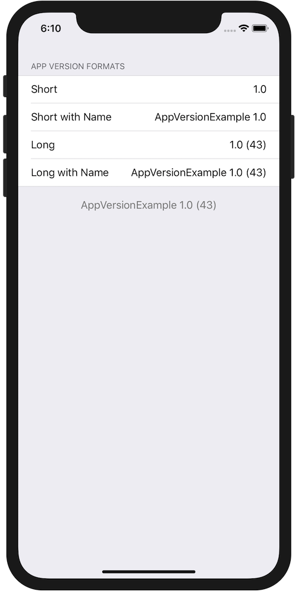
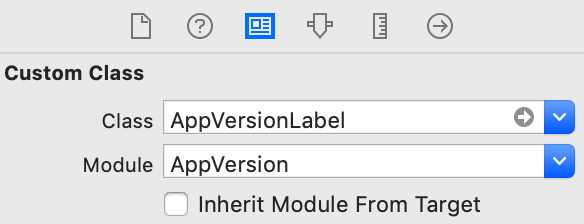
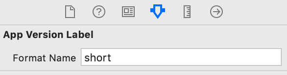

# App Version

[](http://cocoapods.org/pods/AppVersion)
[](https://developer.apple.com/swift)
[](http://cocoapods.org/pods/ReverseExtension)
[](http://cocoapods.org/pods/ReverseExtension)
[](https://github.com/Carthage/Carthage)

###Micro library to display app version within iOS app.
<p align=center>
    
</p>

## Example

### Using Storyboard
Create AppVersion label in storyboard: Drag UILabel on your storyboard and set class to `AppVersionLabel`


After that set format name in Attributes Inpector:


###  Create  `AppVersionLabel` programatically:

```
let versionLabel = AppVersionLabel()
versionLabel.format = format
versionLabel.textAlignment = .center
versionLabel.textColor = .red
```  

### Add version in UITableView footer:
```swift
tableView.addVersionFooter(with: .longWithName)
```
or
```
tableView.addVersionFooter(with: .long, alignment: .right, textColor: .lightGray, footerHeight: 22)
```

## Requirements

- Swift 4.2
- Xcode 10 or greater
- iOS 11.0 or greater

## Installation

#### CocoaPods

AppVersion is available through [CocoaPods](http://cocoapods.org). To install it add the following line to your Podfile:

```ruby
pod "AppVersion.swift"
```

#### Carthage

If you’re using [Carthage](https://github.com/Carthage/Carthage),  add AppVersion to your `Cartfile`:

```
github "amebalabs/AppVersion"
```
Make sure to add `AppVersion.framework` to "Linked Frameworks and Libraries" and "copy-frameworks" Build Phases.

## License

AppVersion is available under the MIT license. See the LICENSE file for more info.
